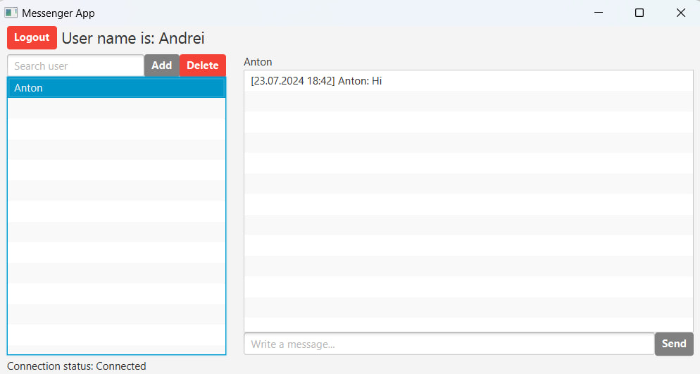

# Clint-Server Messenger Application

## Introduction
This application was developed for hands-on learning of the TCP/IP model, client-server architecture, and message 
encryption. The client part of the application was deployed on AWS using Docker to test its stability and correct 
operation. Additionally, Wireshark was used to verify the confidentiality of the TCP packet contents. 

I used Kotlin to 
implement the program. Although nowadays Kotlin is primarily used for developing mobile applications, but its advantage is 
full interoperability with Java and its simpler, more concise syntax.

Also was developed a simple user Interface for the client part.

## Functionality
The client part is designed in such a way that the user must register their account and then log in. 
Messages can only be sent to users who are already registered; if you try to send a message to a non-existent user, 
you will receive a notification and the message will not be sent.

On the server side, there is a database containing the usernames and passwords of all registered users. 
When a message arrives at the server, it forwards it to the addressee. 
The server only stores messages that haven't been delivered yet, which occurs when the addressee is offline. 
Once the user connects to the server, server checks its database for undelivered messages and sends them to the addressee, 
deleting them from the server afterward.

Message history is stored locally on each user's device. If a user decides to delete their message history, 
it is deleted only on their device. Additionally, not only the packets but also the messages themselves are encrypted. 
This means that the packet is decrypted on the server side, but the actual message content is only decrypted by the 
receiving user. All data, including passwords, logins, and packets, are stored in the database in an encrypted form.

## Example
1. Main menu

2. Registration new user

3. Andre's main screen

4. Log in user

5. Anton send message to Andrei

6. Andrei get message from Anton
